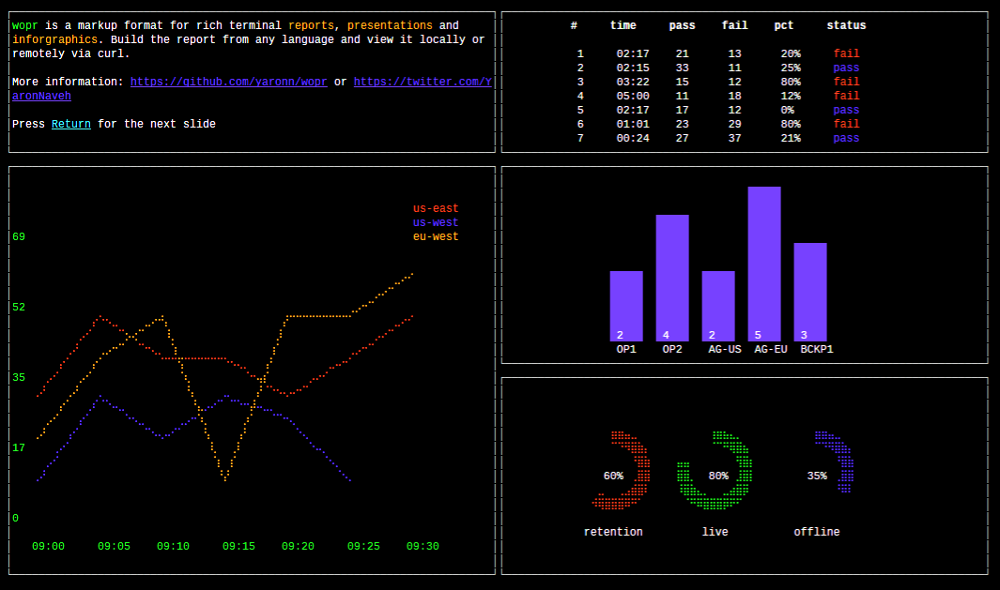

# WOPR

WOPR is a simple markup language for creating [rich terminal reports](https://github.com/yaronn/blessed-contrib), presentations and infographics.

Put [a report](https://raw.githubusercontent.com/yaronn/wopr/master/examples/sample.xml) on the web (e.g. gist) and view it via curl:

`````bash
$> curl -N tty.zone/\[0-2\]\?auto\&cols=$((COLUMNS))
`````
(If you experience firewall issues replace tty.zone with ec2-23-21-64-152.compute-1.amazonaws.com or use a [local viewer](https://github.com/yaronn/wopr#viewing-reports))

Created by Yaron Naveh ([@YaronNaveh](https://twitter.com/YaronNaveh))




##Writing your first terminal report##

Here is a simple report with a bar chart:

`````xml
<document>
  <page>
    <item col="0" row="0" colSpan="5" rowSpan="4">
      <bar maxHeight="5" data-titles="A,B,C" data-data="2,5,3" />
    </item>
  </page>
</document>
`````

You have 3 options to view this report:

**Option 1: POST it to the wopr online viewer**

`````bash
$> curl --data '<document><page><item col="0" row="0" colSpan="5" rowSpan="4"><bar maxHeight="5" data-titles="A,B,C" data-data="2,5,3" /></item></page></document>' tty.zone\?cols=$((COLUMNS))
`````

If you experience firewall issues replace tty.zone with ec2-23-21-64-152.compute-1.amazonaws.com.

**Note:** The online viewer is a reference implementation. Do not send it secret data but rather create [your own](https://github.com/yaronn/wopr/tree/master/server).

**Option 2: POST it from external url**

Save the report content in some url (e.g. gist) and then:

`````bash
$> a=$(curl -s https://gist.githubusercontent.com/yaronn/e6eec6d0e7adac63c83f/raw/50aca544d26a32aa189e790635c8679067017948/gistfile1.xml); curl --data "$a" tty.zone\?cols=$((COLUMNS))
`````

(note you need the gist raw url)

If you experience firewall issues replace tty.zone with ec2-23-21-64-152.compute-1.amazonaws.com.

**Note:** The online viewer is a reference implementation. Do not send it secret data but rather create [your own](https://github.com/yaronn/wopr/tree/master/server).


**Option 3: Via the local viewer**

Save the report xml to report.xml and then:

`````bash
$> npm install -g wopr
$> wopr report.xml
`````

Note the local viewer does not send anything online and does not require network.


##Markup Basics#

**Pages**

A document is a set of pages:

`````xml
<document>
  <page>
    ...
  </page>
  <page>
    ...
  </page>
</document>
`````

**Layout**

A page is a 12x12 grid in which you can position different widgets:

`````xml
<document>
  <page>
    <item col="0" row="0" colSpan="3" rowSpan="3">
      <bar maxHeight="5" data-titles="A,B,C" data-data="2,5,3" />
    </item>
    <item col="5" row="9" colSpan="1" rowSpan="1">
      <box content="some text" />
    </item>
  </page>
</document>
`````

Here, the bar widget is in the first column and row (0-based indexing) and spans three columns and rows.
The box element is in the same page but in a different position.


**Widgets**

The available widgets are the ones that exist in the [blessed](https://github.com/chjj/blessed) and [blessed-contrib](https://github.com/yaronn/blessed-contrib) projects.
You can infer the xml representation of a javascript widget using a simple convention. Assume that you would instantiate some blessed widget with this javascript:

`````javascript
blessed.widget({ string: "5"
               , int: 1
               , intArray: [1,2,3]
               , stringArray: ["a", "b", "c"]
               , multiArray: [ [1,2,3], [4,5,6] ]
               , complexArray: [ {a: 1, b: [1,2] }, {a: 3, b: [3,4]} ]
               , object: { innerProp: 1, multiArray: [ [1,2], [3,4] ] }
})
`````

Then here is how you would represent it in xml:
    
`````xml
<widget string="5" int="1" intArray="1,2,3" stringArray="a,b,c" object-innerProp="1">
  <multiArray>
    1,2,3
    4,5,6
  </multiArray>
  <object-multiArray>
    1,2
    3,4
  </object-multiArray>
  <complexArray>
    <m a="1" b="1,2" />
    <m a="3" b="3,4" />
  </complexArray>
</widget>
`````

You can also look at the [demo xml](https://raw.githubusercontent.com/yaronn/wopr/master/examples/sample.xml) to get more samples.


##Viewing Reports##


Depending on how you use a report, you have a few ways to view it. On Windows you will probably only be able to use the third option and need to [install the fonts](http://webservices20.blogspot.com/2015/04/running-terminal-dashboards-on-windows.html) for best view.

**Option 1: POST it to the wopr online viewer**

`````bash
$> curl --data '<document><page><item col="0" row="0" colSpan="5" rowSpan="4"><bar maxHeight="5" data-titles="A,B,C" data-data="2,5,3" /></item></page></document>' tty.zone\?cols=$((COLUMNS))
`````

If you experience firewall issues replace tty.zone with ec2-23-21-64-152.compute-1.amazonaws.com.

**Option 2: POST it from external url**

Save the report content in some url (e.g. gist) and then:

`````bash
$> a=$(curl -s https://gist.githubusercontent.com/yaronn/e6eec6d0e7adac63c83f/raw/50aca544d26a32aa189e790635c8679067017948/gistfile1.xml); curl --data "$a" tty.zone\?cols=$((COLUMNS))
`````

(note you need the gist raw url)

If you experience firewall issues replace tty.zone with ec2-23-21-64-152.compute-1.amazonaws.com.

Tip: If you use a url shortener (e.g. bit.ly) add the -L flag to curl to follow redirects.

**Option 3: via the local viewer**

Save the report xml to report.xml and then:

`````bash
$> npm install -g wopr
$> wopr report.xml
`````

Note the local viewer does not send anything online and does not require network.

Tip: Maximize the terminal before viewing the report for best viewing experience
Tip: If you CTRL+C in the middle or rendering your cursoe might disappear. Restore it by running again and letting the render complete or with $> echo '\033[?25h'

**View customization**
When using the online reports, you might need to adjust the slides size based on your font / resolution or use non-xterm terminal. tty.zone supports the following query params:

`````bash
curl -N tty.zone\?\&cols=200\&rows=50\&terminal=xterm
`````

You can infer them automatically from your environment:

`````bash
curl -N tty.zone\?\&cols=$((COLUMNS))\&rows=$((LINES-5))\&terminal=${TERM}
`````

It is best to escape all special characters (e.g. ? &) as seen in the above samples, since some shells will require this (zsh).


**Pages**

When viewing a report with the local viewer you can advance slides with the Return or Space keys.
When using the online viewer you have 2 options:

**Option 1:** Manually advance slides with Return or Space:

`````bash
p=0; while true; do curl tty.zone/$((p++))\?cols=$((COLUMNS)); read; done
`````

**Option 2:** Slides advance automatically every 5 seconds:

`````bash
curl -N tty.zone/\[0-2\]\?auto\&cols=$((COLUMNS))
`````

Where 0 is the index of the first slide and 2 of the last slide. Keep the brackets in the url (they are not to express optional argument) and escape them as in the above sample.

Tip: disable curl buffering with the -N flag

You can also view a specific slide (#4 in this case):

`````bash
curl --data '<document>...</document>' tty.zone/4\?cols=$((COLUMNS))
`````

##License##
MIT


## More Information
Created by Yaron Naveh ([twitter](http://twitter.com/YaronNaveh), [blog](http://webservices20.blogspot.com/))
